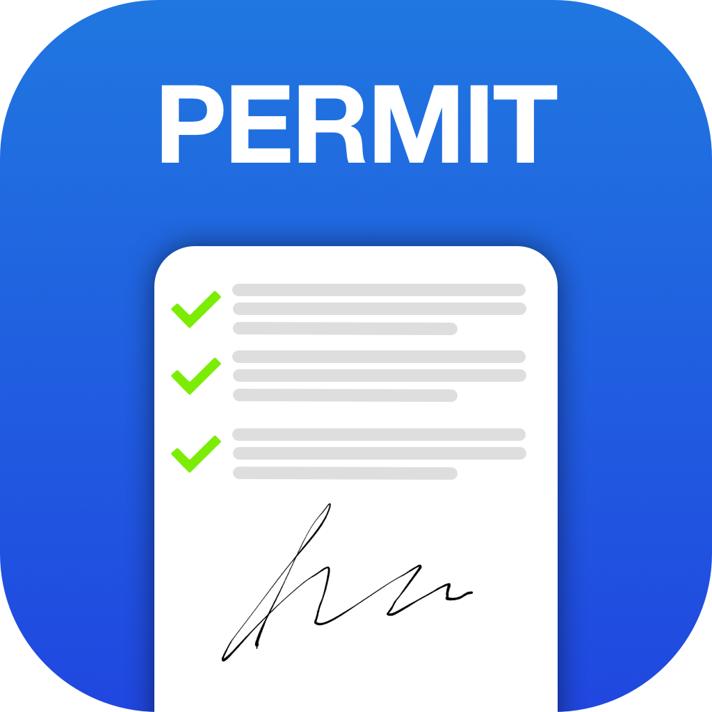
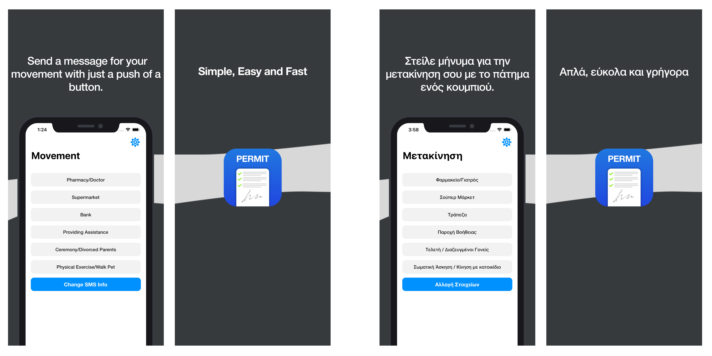

# Greek Moving Permit 📝

This a very small and simple utility app that aims to automate the mandatory messages (SMS) that must be sent to **13033** in order to move during the **COVID19** quarantine(lockdown) at Greece.

The application was created at 17/04/20.

   

## Technologies & Features
* Bilingual (English - Greek) based on iPhones system language
* Dark & Light mode 🌗
* Local Data persistence using **Disk** *( because of the very low volume of data needed to be stored a simple solution like this is way more time efficient)*
* All UI written purely in swift with out the use of storyboards
* Consistent typography and color scheme through out the app with the use of a configurable class's for both. That way it's easy to make styling changes in the future
* Designed with a native iOS look using Sketch

## Preview

#### Video Preview
Google Drive: https://drive.google.com/file/d/1wkyVGcpVvtNrYfPzrdpxkMDx-Mm_QyJP/view?usp=sharing

